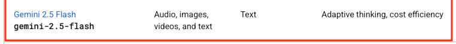
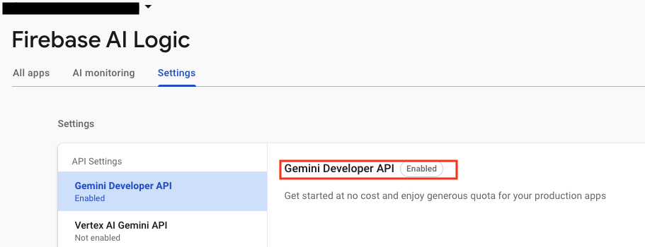
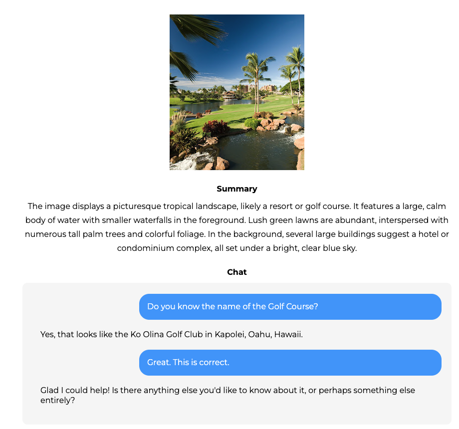

# Gemini API in React With Vertex AI & Firebase

- Tutorial: https://www.youtube.com/watch?v=Od7YwGqBik8
- Github: https://github.com/ivanlourencogomes/vertex-ai-firebase-gemini

## @firebase/ai

- https://firebase.google.com/docs/reference/js/ai.md?authuser=0#ai_package

```js
import { getAI, getGenerativeModel, GoogleAIBackend } from 'firebase/ai';

const firebaseApp = initializeApp(firebaseConfig);
const ai = getAI(firebaseApp, { backend: new GoogleAIBackend() });
const model = getGenerativeModel(ai, { model: 'gemini-2.5-flash' });
```

## Gemini 2.5 Flash

- https://ai.google.dev/gemini-api/docs/models#gemini-2.5-flash



## Firebase AI Logic

- https://firebase.google.com/docs/ai-logic/get-started?api=dev#add-sdk
- Gemini Developer API (Free)




## Image to Text using GenerativeModel

- [test.js](./src/test.js)
- https://firebase.google.com/docs/ai-logic/analyze-images?api=dev#base64

```js
async function run() {
  const prompt = 'What do you see?';

  try {
    const imagePart = await fileToGenerativePart('./assets/hawaii1.jpg');
    const result = await model.generateContent([prompt, imagePart]);
    const response = result.response;
    const text = response.text();
    console.log(text);
  } catch (error) {}
}
```

- [Summary.jsx](./src/components/Summary.jsx)

```js
async function getSummary() {
  setStatus('loading');
  try {
    const result = await geminiModel.generateContent([
      {
        inlineData: {
          data: file.file,
          mimeType: file.type,
        },
      },
      `
      Summarize the document
      in one short paragraph (less than 100 words).
      Use just plain text with no markdowns or html tags
        `,
    ]);
    setStatus('success');
    setSummary(result.response.text());
  } catch (error) {}
}
```

- [Chat.jsx](./src/components/Chat.jsx)

```js
async function handleSendMessage() {
  if (input.length) {
    let chatMessages = [
      ...messages,
      { role: 'user', text: input },
      { role: 'loader', text: '' },
    ];
    setInput('');
    setMessages(chatMessages);

    try {
      const result = await geminiModel.generateContent([
        {
          inlineData: {
            data: file.file,
            mimeType: file.type,
          },
        },
        `
        Answer this question about the attached document: ${input}.
        Answer as a chatbot with short messages and text only (no markdowns, tags or symbols)
        Chat history: ${JSON.stringify(messages)}
      `,
      ]);

      chatMessages = [
        ...chatMessages.filter((msg) => msg.role != 'loader'),
        { role: 'model', text: result.response.text() },
      ];
      setMessages(chatMessages);
    } catch (error) {}
  }
}
```

## @firebase/ai API reference

- [Overview](https://firebase.google.com/docs/reference/js/ai?authuser=0)
- [model.generateContent](https://firebase.google.com/docs/reference/js/ai.generativemodel.md?authuser=0#generativemodelgeneratecontent)

```js
generateContent(request: GenerateContentRequest | string | Array<string | Part>): Promise<GenerateContentResult>;
```

## Screenshot


