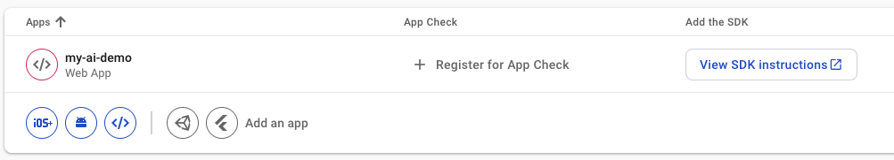

# Use Gemini API in React With Vertex AI & Firebase

- Tutorial: https://www.youtube.com/watch?v=Od7YwGqBik8
- Github: https://github.com/ivanlourencogomes/vertex-ai-firebase-gemini

## @firebase/ai

- https://firebase.google.com/docs/reference/js/ai.md?authuser=0#ai_package

```js
import { getAI, getGenerativeModel, GoogleAIBackend } from 'firebase/ai';

const firebaseApp = initializeApp(firebaseConfig);
const ai = getAI(firebaseApp, { backend: new GoogleAIBackend() });
const model = getGenerativeModel(ai, { model: 'gemini-2.5-flash' });
```

## GenerativeModel.generateContent()

- You can use generateContent() to generate text from a prompt that contains text:
- https://firebase.google.com/docs/reference/js/ai.generativemodel.md?authuser=0#generativemodelgeneratecontent

```js
generateContent(request: GenerateContentRequest | string | Array<string | Part>): Promise<GenerateContentResult>;
```

```js
async function getSummary() {
  setStatus('loading');

  try {
    const result = await geminiModel.generateContent([
      {
        inlineData: {
          data: file.file,
          mimeType: file.type,
        },
      },
      `
          Summarize the document
          in one short paragraph (less than 100 words).
          Use just plain text with no markdowns or html tags
        `,
    ]);
    setStatus('success');
    setSummary(result.response.text());
  } catch (error) {
    setStatus('error');
  }
}
```

## GenerateContentResult interface

```js
response;
```

- [Gemini 2.5 Flash](https://ai.google.dev/gemini-api/docs/models#gemini-2.5-flash)
- Input: Audio, images, videos, and text
- Output:Text
- Adaptive thinking, cost efficiency

## References

- https://firebase.google.com/docs/ai-logic/get-started?api=dev
- https://firebase.google.com/docs/ai-logic/get-started?api=dev#initialize-service-and-model


